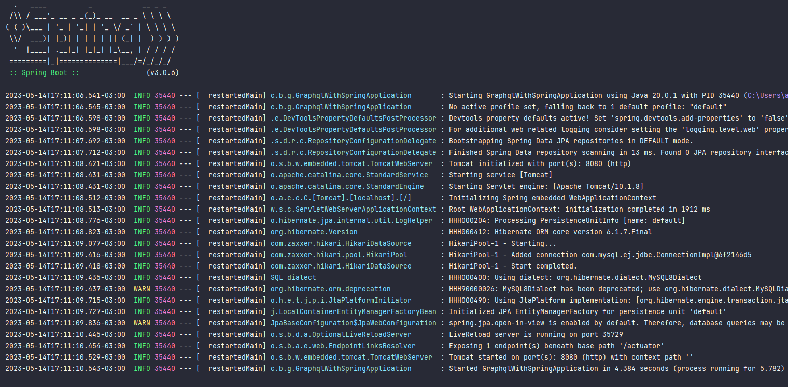
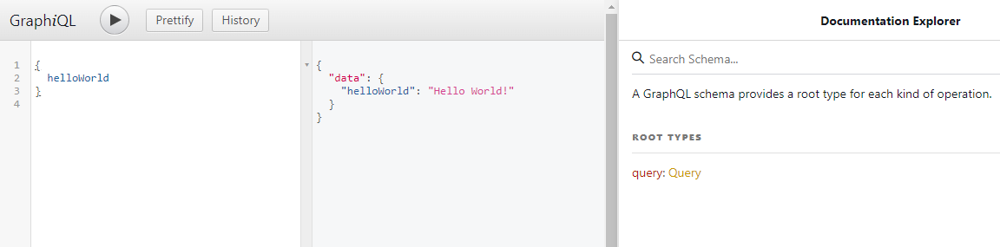
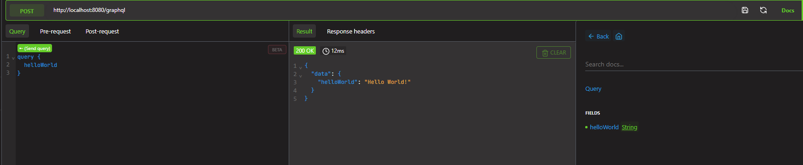
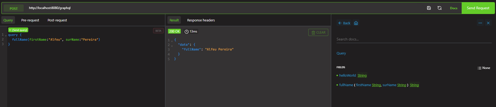
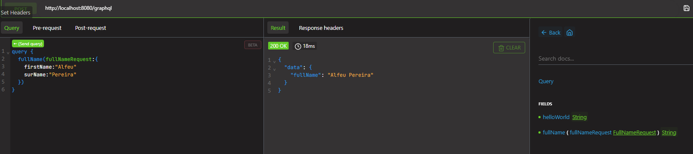

# This is a study project focusing on GraphQL + Spring Boot


## First of all those are the dependencies I have used:

[Spring Boot Starter](https://mvnrepository.com/artifact/org.springframework.boot/spring-boot-starter)

[Spring Boot Starter Web](https://mvnrepository.com/artifact/org.springframework.boot/spring-boot-starter-web)

[Lombok](https://mvnrepository.com/artifact/org.projectlombok/lombok)

[GraphQL Spring Boot](https://mvnrepository.com/artifact/com.graphql-java-kickstart/graphql-spring-boot-starter)

[GraphQL Java Tools](https://mvnrepository.com/artifact/com.graphql-java-kickstart/graphql-java-tools)

[GraphiQL&GraphQL](https://github.com/graphql-java-kickstart/graphql-spring-boot)


## Writing the first query

<p><b>1.</b> First, it was created a package named 'query' located in 'com.businessname.query'.</p>
<p><b>2.</b> Second, I created a class called Query to implement the class GraphQLQueryResolver, this class will be responsible for make Query class being able to work with query. So now we are able to create some methods to be consumed using Altair. This is how our class should look like: 

```
package com.businessname.graphqlwithspring.query;

import graphql.kickstart.tools.GraphQLQueryResolver;

public class Query implements GraphQLQueryResolver {

    public String helloWorld(){
        return "Hello World!";
    }
}
```

Regarding the GraphQLQueryResolver, these are some actions that it can provide:</p>
<li>Field Resolution</li>
<li>Data Fetching</li>
<li>Data Transformation</li>
<li>Parent-Child Field Resolution</li>
<li>Error Handling</li>

<p><b>3.</b>To make the application recognize the query type, it should be defined on graphql schema. It usually goes on resources.schema.nameofthegraphqlfile, remember that this file use have the extension <b>.graphqls</b></p>

<p>The file should look like this:</p>

```
type Query {
    helloWorld : String
}
```

<p>The name of class 'Query', 'helloWorld' is the method created and String which is the data type.Once it is done, let's see how to request for this.</p>


## Requesting data with Hello World query

<p>Before start the application, make sure your app class looks something like the class below.</p>

```
@ComponentScan({"com.businessname.graphqlwithspring.query"}) // path to query package
@SpringBootApplication
public class GraphqlWithSpringApplication {

	public static void main(String[] args) {
		SpringApplication.run(GraphqlWithSpringApplication.class, args);
	}

}
```

<p>After starting the application as you can see the img below, open on the browser graphiql url: </p>


<p>Application Started.</p>


<p>http://localhost:8080/graphiql. Note that after requesting, the url may change to: 'http://localhost:8080/graphiql?query=%7B%0A%20%20helloWorld%0A%7D%0A', you may have also noticed that the tab documentation shows the query type, which is one of the advantages of using graphql, it creates a doc automatically.</p>


<p>Another way to request information from your application is using Altair GraphQL Client plugin, which you can find <a href="https://chrome.google.com/webstore/detail/altair-graphql-client/flnheeellpciglgpaodhkhmapeljopja">here</a>.</p>

<p><b>PS: All calls to GraphQL are considered 'POST' methods.</b></p>


<p>Note that the default url for altair is 'http://localhost:PORTNUMBER/graphql'.</p>
<p>Just like GraphiQL, Altair has the tab Documentation as well.</p>


## GraphQL query with input data

A GraphQL query with input data is used to retrieve specific data from a GraphQL server by passing input parameters or arguments to a query. Let's see an example.</p>

<p>First, we should create a method in the Query class:</p>

```
public String fullName(String firstName, String surName){
     return firstName + " " + surName;
}
```

<p>After that, we're supposed to define in the schema:</p>

```
type Query {
    helloWorld : String
    fullName(firstName: String , surName: String): String
}
```

<p>Note that it's defined the two data of the two inputs individually(firstName and surName) as well as the return of the method, all of them of type String. The method basically concatenate the two input strings.</p>



<p>Let's consider now an object instead of two Strings, how would it look like?</p>
<p>First, we create the package 'request' and the class FullNameRequest:</p>

```
package com.businessname.graphqlwithspring.request;

import lombok.Getter;
import lombok.Setter;

@Getter
@Setter
public class FullNameRequest {
    
    private String firstName;
    private String surName;
}


```

<p>We should change the parameter to FullNameRequest(the object) of the method and define its type in schema:</p>

```
public String fullName(FullNameRequest fullNameRequest){
     return firstName + " " + surName;
}
```

```
type Query {
    helloWorld : String
    fullName(fullNameRequest : FullNameRequest): String
}


input FullNameRequest{
    firstName : String
    surName : String
}
```


<p>Note that now the request has an object as parameter, which made the query change a bit and looks more like a json object:</p>



<p>Although we define in the schema, we should also validate wether it can be null or not. As the example:</p>

```
input FullNameRequest{
    firstName : String!
    surName : String!
}
```
<p>By adding a '!' after the type of the data, it won't be able to accept null or empty values.</p>

## Mapping graphiql and graphql routes

<p>By default, graphiql route is mapped by '/graphiql' and graphql by 'graphql. However, how could we identify which resource is being requested? Well there you go:</p>

<p>The first step to map those routes is set them on 'application.properties' file: </p>

```
#By default /graphiql
graphiql.mapping=/app-ui

#By default /graphql
graphql.servlet.mapping=/customer-services
```

## GraphQL and Spring Data JPA

<p>In this step, entities were created(Client, Product and Order) as well as its repositories extending JpaRepository and its resolvers classes. As we've built previously, it was also added its objects on the schema.</p>
